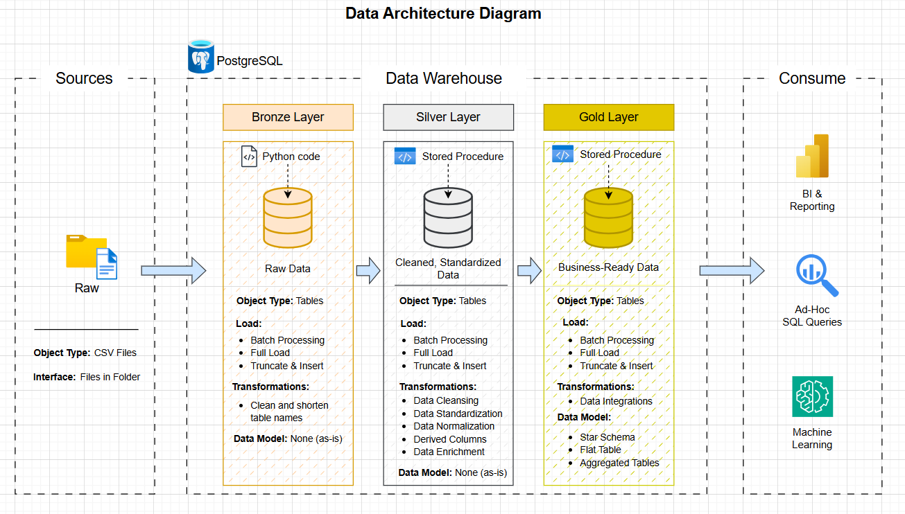
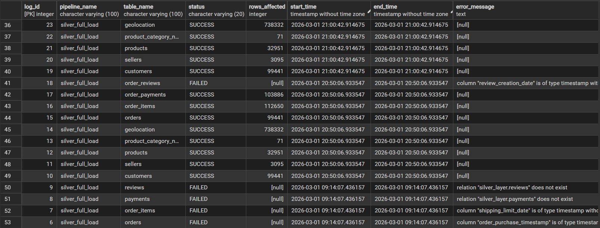

# End-to-End E-commerce Data Engineering Pipeline

## Overview

This project demonstrates the design and implementation of a complete **end-to-end data engineering project** for an e-commerce dataset.

The pipeline ingests raw data, performs cleaning and transformation, and builds an analytics-ready data warehouse using a layered architecture. The goal is to simulate how production data engineering pipelines move data from raw ingestion to structured business intelligence datasets.

The project follows the **Medallion Architecture (Bronze → Silver → Gold)**, where data quality and structure progressively improve across layers.

The dataset used is the **Olist Brazilian E-commerce dataset**, which contains transactional data including customers, orders, products, payments, reviews, and sellers.

This project demonstrates practical data engineering concepts such as:

* Data ingestion pipelines
* Data cleaning and transformation
* Dimensional data modeling
* SQL-based ETL processes
* Pipeline logging and monitoring
* Version control and reproducibility

---

# Project Scope

The objective of this project is to build a realistic **data engineering pipeline** that mimics workflows used in modern data platforms.

The project covers the following stages:

1. **Raw data ingestion using python**

   * Load multiple CSV datasets
   * Maintain original data structure

2. **Data cleaning and standardization with PostgreSQL**

   * Remove duplicates
   * Cast appropriate data types
   * Handle inconsistent records

3. **Data warehouse modeling**

   * Transform normalized tables into dimensional models
   * Build fact and dimension tables

4. **Analytics-ready datasets**

   * Enable business insights through structured tables
   * Support common analytical queries

The result is a fully functional **data pipeline and warehouse architecture** capable of supporting reporting and business analytics.

---

# Dataset

The dataset used in this project comes from the **Olist Brazilian E-commerce dataset from Kaggle**.

It contains transactional information about an online marketplace including:

* Customers
* Orders
* Order Items
* Products
* Sellers
* Payments
* Reviews
* Geolocation data

The dataset simulates the operational data of an e-commerce platform, making it suitable for designing realistic data pipelines.
link to the dataset: https://www.kaggle.com/datasets/olistbr/brazilian-ecommerce

---

# Project Architecture

This project implements a **three-layer Medallion Architecture**:

Bronze → Silver → Gold

Each layer represents a stage in the data lifecycle, gradually improving the usability and quality of the data.

A visual architecture diagram illustrating the pipeline structure will be included below.



---
# Project Structure

```
Ecommerce-data-pipeline/
│
├── data/                                                  # Raw datasets
│   └── raw/                                               # Original CSV files used in the project but not save in github and igroned in gitignore due to large files
│
├── notebooks/                                             # Project documentation
│   ├── data_architecture_diagram_ecommerce.drawio         # Overall Medallion architecture diagram
│   ├── data_catalog.md                                    # data catalog for gold layer tables
│   ├── data_flow_diagram_ecommerce.drawio                 
│   ├── data_pipeline_layers.md                            
│
├── sql/                                                   # SQL transformations and warehouse scripts
│
│   ├── logging/                                           # Pipeline logging infrastructure
│   │   └── logging.sql                                    # Logging schema + pipeline_log table
│
│   ├── silver_layer/                                      # Silver layer transformations
│   │   ├── ddl_silver.sql                                 # Create Silver tables
│   │   └── load_silver.sql                                # Stored procedure to clean + load data
│
│   └── gold_layer/                                        # Data warehouse layer
│       ├── ddl_gold.sql                                   # Create dimension and fact tables
│       └── load_gold.sql                                  # Stored procedure for Gold layer loading
|
├── src/                                                   # Python code (Bronze ingestion pipeline)
│   ├── load_bronze.py                                     # Main ingestion script with logging
│
├── .env                                                   # Where user password, database name, host name are stored and added in gitigrone
├── .env example                                           # to show others the example format of how env file saved
│
├── README.md                                              # Project documentation
├── .gitignore                                             # data/raw and .env are added
└── LICENSE
```

---

# Logging and Pipeline Monitoring

To simulate real production pipelines, the project includes a **logging system for ETL execution**.

The logging framework records:

* Pipeline name
* Table being processed
* Execution start time
* Execution end time
* Row counts
* Error messages



This enables:

* pipeline observability
* debugging
* execution tracking

Logging was implemented using SQL tables and stored procedures.

---


# Technologies Used

| Technology | Purpose                          |
| ---------- | -------------------------------- |
| Python     | Bronze data ingestion            |
| Pandas     | Data extraction and loading      |
| PostgreSQL | Data warehouse database          |
| SQL        | Data transformation and modeling |
| Git        | Version control                  |
| GitHub     | Project repository               |

---

# Example Analytical Use Cases

The final Gold layer enables answering common business questions such as:

* What are the top selling product categories?
* Which sellers generate the most revenue?
* How does revenue change month-to-month?
* What payment methods are most common?
* How do review scores relate to sales performance?

These insights can easily be queried from the **fact and dimension tables in the Gold layer**.

---

# Future Improvements

Possible enhancements to extend this project include:

* Automating pipeline orchestration using Airflow
* Implementing incremental data loads
* Adding data quality checks and validation tests
* Deploying the pipeline to a cloud data warehouse
* Building dashboards using BI tools such as Power BI or Tableau
---

# What I Learned

Through this project I gained hands-on experience with:

* Designing scalable data pipelines
* Implementing medallion architecture
* Building dimensional data models
* Writing production-style SQL transformations
* Managing data workflows with version control

---

# Repository

GitHub Repository:

https://github.com/overseersnowfall/Ecommerce-data-pipeline

---
